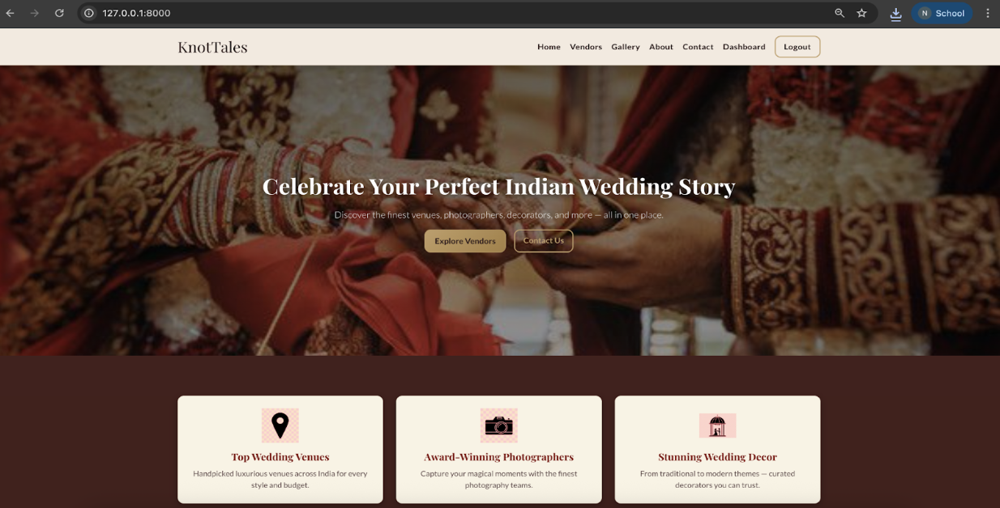
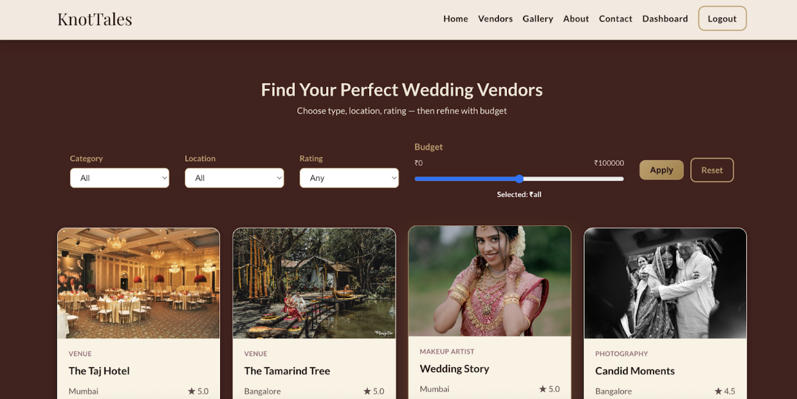
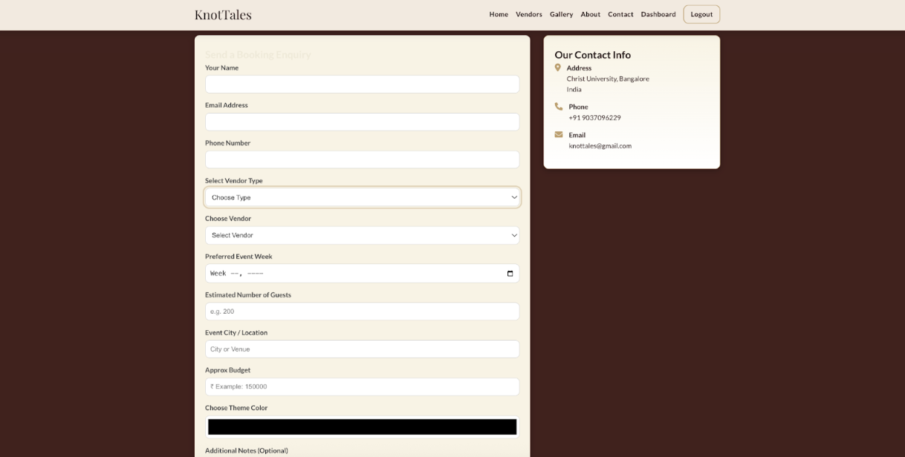
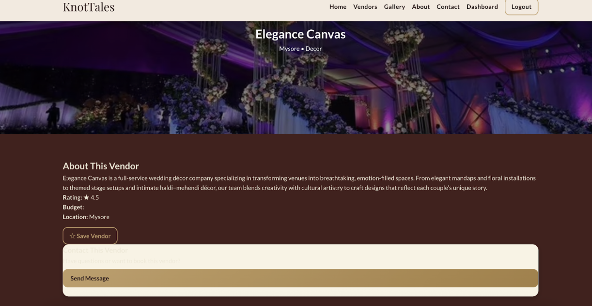
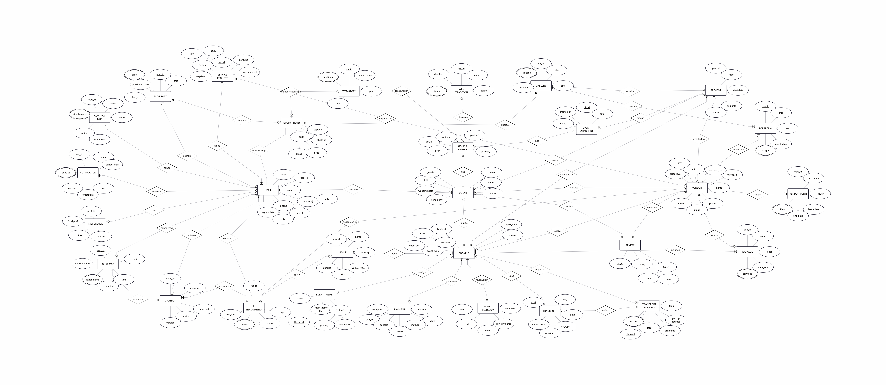

# KnotTales 💍

> Planning a wedding is complicated. Finding the right vendors shouldn't be.

A full-stack wedding vendor discovery and management platform built with Django.

## 🎥 Demo

---

## ✨ Features

- Vendor discovery and filtering
- Dynamic booking enquiry system
- Vendor profiles
- Wedding inspiration gallery
- User authentication
- Responsive design

---

## 📸 Screenshots

### Home Page

### Vendor Discovery

### Booking Enquiry

### Vendor Details

### Database Design

---

## 🛠️ Tech Stack

Frontend:
- HTML
- CSS
- JavaScript

Backend:
- Django
- Python

Database:
- MySQL

---

## 🚀 Key Learnings

- Full-stack development with Django
- Database design and normalization
- Dynamic filtering using Fetch API
- Form validation
- Frontend-backend integration

---

## 👩‍💻 Author

Nipuna Ashok
